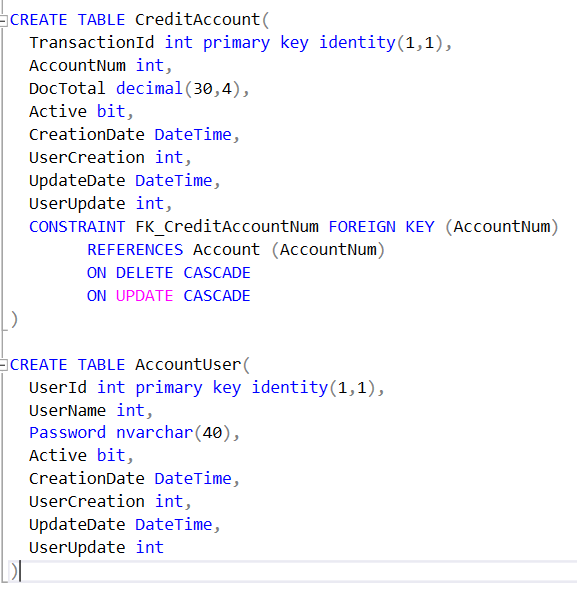

# AppcreditPayment
AppcreditPayment
Xamarin 
C#
MVVM

# DataConfig
    Crea la estructura de base de datos a base de tus objetos con NHibernate
    
    Ejemplo 
  </img>
    
    
#  Data.ControlCenter Capa de acceso a datos
     Persistencia con ORM NHibernate
      - Model
      - Repository
      - Map
 </img>
   
# Or Create DB of SQL DDL
    
 </img>
 </img>
 </img>
 </img>
 </img>
 </img>
 </img>
 </img>
 </img>
   
   
# DomainModels 
    Coleccion de Modelos DTO a utilizar en la aplicaciones
     - AutoMapper entre Models.DTO y Data.Model
     - Modelos utilizados en la API 
     - Modelos utilizados en la Aplicacion mobil
  </img>
     
 # webapiapp Capa de Aplicación Logica de Negocio API
     - Proyecto Web API
     - Controllers
  </img>
  </img>
  </img>
  
 # AppSalesLogic Capa de Presentación de aplicación mobil - Xamarin Forms MVVM
     - Views
     - ViewModels
     - Services 
     - Infraestructure
 </img>
 </img>
 </img>
 </img>
 </img>
      
     
     
 # AppWeb Capa de Presentación de aplicación Web - React
     - actions
     - components
     - reducers
     - pages
     - type
     
 

